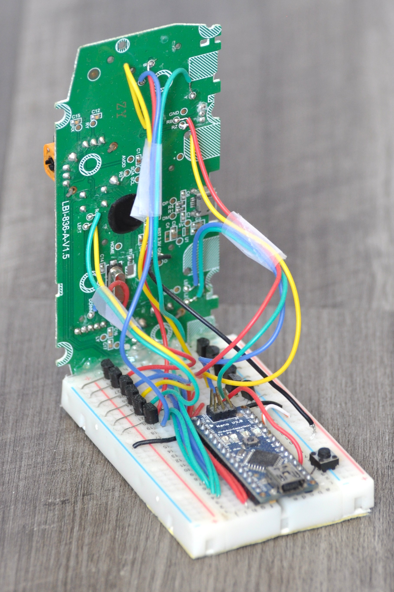
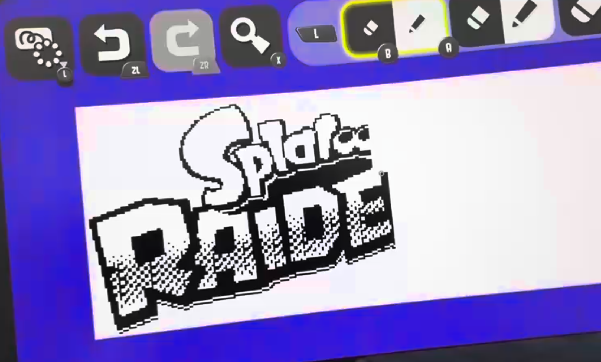

# Arduino Printer
This was a fun weekend-project program written for an Arduino Nano hooked to a Nintendo Switch controller. By pulling the debug pins with the Arduino, we can simulate button presses programmatically.

Several Nintendo games (i.e. Splatoon 2/3) allow the player to draw 320x120 images to be displayed in game. This repository allows an image file to be printed in game using programmed button presses.

This conversion happens in two stages:

- [CreateHeader.py](CreateHeader.py) - A provided image file is compressed to a 1-bit (black or white) color palette and placed inside a header file.
- [Printer.ino](Printer.ino) - Compiles with the provided header file and calculates the button press sequence required to print the image.

The Arduino does not have enough memory to store a full 320x120 image by default, so the Python script packs the image into an integer array, where reading the bits from high to low on a given integer gives you the pixel values (1 for black, 0 for white).

There is some simple printing optimization to speed up printing. Instead of simply using alternating scanlines, the images are split into 600 square chunks and those are printed in a horizontal snake pattern. This helps minimize unnecessary cursor travel and chunks that have no pixels can simply be skipped.

